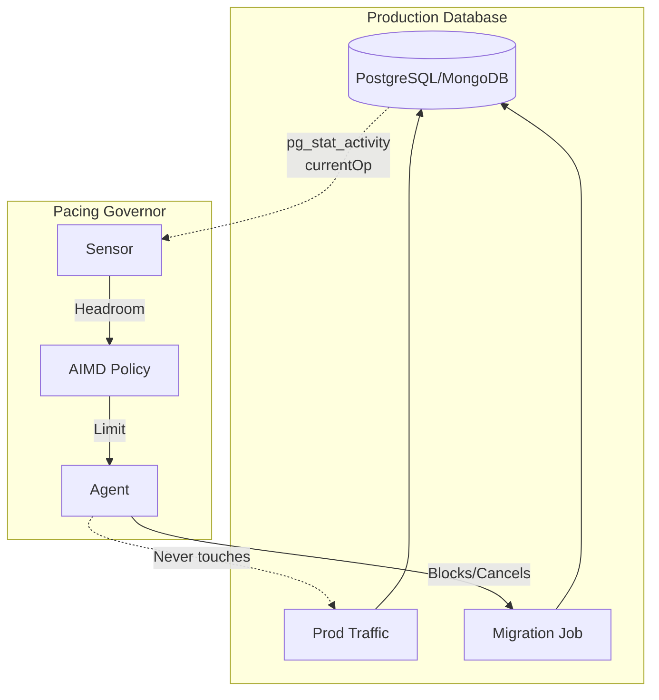
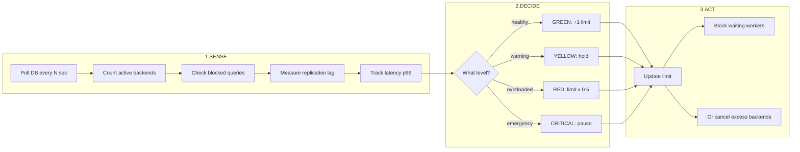
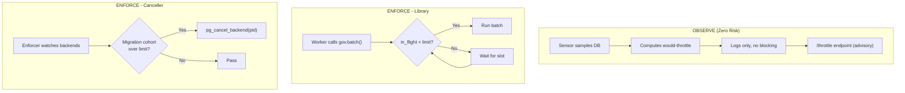
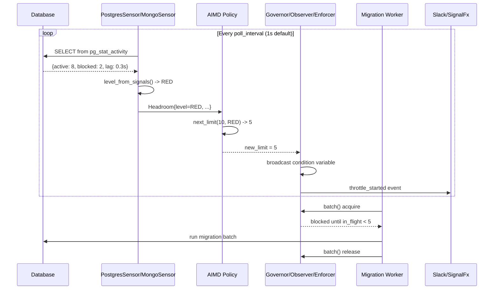
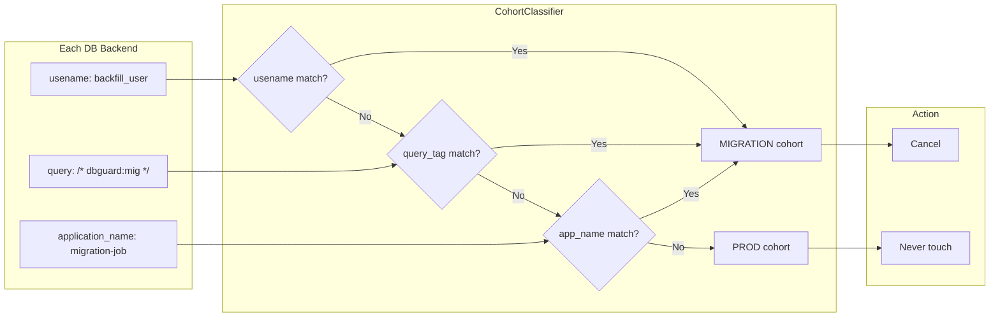
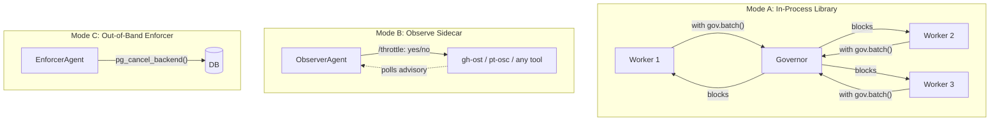

# Architecture

How **pacing-governor** senses live database health and throttles migration /
backfill jobs so they can't take production down. A closed feedback loop modelled
on TCP congestion control (AIMD): **sense → decide → act**.

## High-Level Architecture

## The Control Loop (TCP Congestion-Style)

## Three Operating Modes

| Mode | Description | Use Case |
|------|-------------|----------|
| **OBSERVE** | Shadow mode — logs what it *would* throttle, never blocks | Zero-risk proof-of-value |
| **ENFORCE (Library)** | Workers call `gov.batch()`, blocked until headroom | In-process backfill jobs |
| **ENFORCE (Canceller)** | Out-of-band `pg_cancel_backend()` / `killOp()` | Non-cooperative migrations |

## Signal Flow: Sense -> Decide -> Act

## Health Levels

| Level | Condition | AIMD Action |
|-------|-----------|-------------|
| 🟢 **GREEN** | active < threshold, no blocked, lag < 1s | **Increase** limit +1 |
| 🟡 **YELLOW** | approaching threshold, or lag 1-5s | **Hold** limit |
| 🔴 **RED** | over threshold, or blocked > 0, or lag > 5s | **Decrease** limit × 0.5 |
| ⚫ **CRITICAL** | severe overload | **Pause** (limit → 0) or throttle to min |

Secondary signals (replication lag, connection-pool saturation, query latency p99)
can only **raise** the level, never lower it.

## Workload Attribution (Surgical Enforcement)

The governor surgically targets only the migration cohort, **never touching prod queries**.

**Signal precedence:** `usename` (strongest) → `query_tag` → `application_name` (weakest)

## Deployment Modes

## Result: Before vs After

```mermaid
gantt
    title Without Governor
    dateFormat X
    axisFormat %s
    section Migration
    Backfill runs full speed :a, 0, 60
    section Prod Latency
    p99 spikes to 5s :crit, b, 10, 50
    section Outcome
    Checkout failures :crit, c, 20, 40
```

```mermaid
gantt
    title With Governor (AIMD throttling)
    dateFormat X
    axisFormat %s
    section Migration
    Batch 1-5 (GREEN) :a, 0, 10
    Batch 6-8 (YELLOW hold) :b, 10, 20
    Batch 9-10 (RED backoff) :c, 20, 30
    Resume (GREEN) :d, 30, 60
    section Prod Latency
    p99 stays under 200ms :done, e, 0, 60
    section Outcome
    Zero checkout failures :done, f, 0, 60
```

## Summary

A closed feedback loop that senses DB health → decides using AIMD → acts by
blocking workers or cancelling backends. Production queries are **never touched**;
migrations self-throttle or get cancelled.
